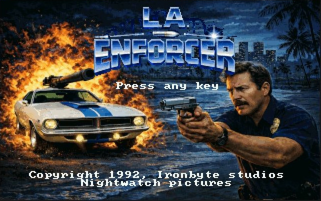
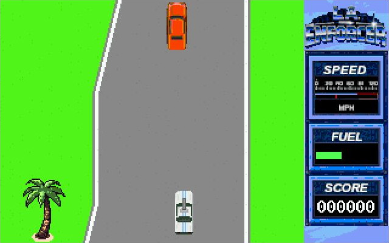

# LA Enforcer – Retro DOS Arcade Game

## Motivations & Objectif

LA Enforcer est un projet personnel visant à recréer un jeu d’arcade DOS rétro. C'est une fausse adaptation de film de série B, avec des graphismes VGA inspirés des jeux de l'ère 286/386, jouable avec DOSBox.

Le jeu est écrit principalement en C, avec une routine d’affichage en assembleur. Le but était de comprendre la manière de coder un jeu PC au début des années 90 et les optimisations nécessaires.

J'ai compris que le PC n'était pas vraiment fait pour les jeux d'arcade (et c'est ce qui est intéressant), et que les bons programmeurs de l'époque étaient presque des héros, capables de tirer des performances impressionnantes d’un matériel très limité.

Les aspects qui m’ont le plus intéressé sont :

- l’optimisation de l’affichage
- les logiques de jeu (collisions, comportement des ennemis), optimisées elles aussi
- la génération du décor
- l’affichage d’images d’introduction en mode VGA 320×200, 256 couleurs, avec des palettes spécifiques

Certains aspects plus bas niveau très spécifiques au DOS (gestion des interruptions clavier ou audio) ont été réalisés avec l’aide d’outils d’assistance au développement, notamment des suggestions générées par IA, que j’ai ensuite adaptées et intégrées au projet.

## Capture d'écran

## Caractéristiques

- Affichage VGA en mode 13h
- Double buffering logiciel
- Rendu de sprites compressés en Run-Length Encoding (RLE) vertical
- Décors générés procéduralement

## Ce que j'ai appris

- Les bases de l'assembleur et le fonctionnement du microprocesseur dans le cadre d'un jeu DOS
- L'optimisation dans les processus critiques (affichage, logique de jeu)
- L'architecture d'un jeu en C
- Programmer de la physique sans division ni nombres flottants, trop coûteux sur anciens processeurs, en utilisant des coordonnées en fixed point

## Ce que j'aurais pu améliorer

Le projet a commencé comme une expérimentation sans but précis. Avec un plan global dès le départ, j'aurais probablement gagné du temps et conçu une architecture plus claire.

Notamment, la distribution des responsabilités dans le code est perfectible, d’autant plus que j’ai parfois privilégié l’optimisation à la clarté de l’architecture. Le C sur processeur 386 est très loin du confort de programmation d’un langage moderne comme le C#.

## Développements futurs possibles

- Son AdLib. J'ai commencé à étudier le sujet, qui est passionnant mais aussi très complexe et aurait probablement compromis la complétion du projet.

## Comment jouer ?

Touches fléchées pour se déplacer
Ctrl pour tirer
Alt + direction pour un déplacement latéral rapide

Détruisez les voitures orange, épargnez les voitures marron.

Récupérez l'essence laissée par les voitures détruites. Les checkpoints remplissent votre réservoir.

## Démarrage

Utilisez le 'run.bat' ou le 'run-linux.sh' fourni dans la release, ou dosbox avec dosbox.conf : fullscreen=true, cycles=fixed 9000

## Build

Nécessite Open Watcom.

make

## Auteur

Projet réalisé par Julien CORREARD.

## Licence

Ce projet est sous licence MIT. Voir fichier LICENSE.
